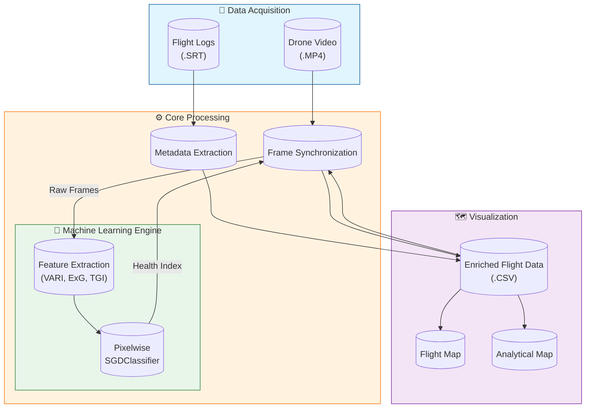

# Drone Health Mapping Pipeline 🚁🌱

## Overview

This project implements a complete data processing pipeline for generating **Vegetation Health Maps** from drone video footage. It processes raw video and SRT metadata to calculate health indices (like VARI, ExG, TGI) using a **Pixelwise Machine Learning Model** (`SGDClassifier`).

The pipeline transforms raw drone data into interactive HTML maps that visualize:
1.  **Flight Trajectories** (Flight Map)
2.  **Vegetation Health Heatmaps** (Analytical Map)

## 🏗️ System Architecture



## 📂 Project Structure

The workspace is organized modularly:

```text
/home/mhc/Germany/Drone/DJI_HOF/
│
├── main.py                     # 🚀 MAIN ENTRY POINT (Run everything from here)
│
├── datasets/                   # 📦 RAW DATA SOURCES
│   ├── PlantVillage/           # Labeled images for training
│   ├── Dataset_Hipolito_drone/ # Drone videos for training (weak supervision)
│   └── flights/                # Input Drone Flight Folders (e.g., DJI_..._D)
│
├── src/                        # 🛠️ SOURCE CODE
│   ├── ingestion/              # Metadata extraction from .SRT files
│   ├── models/                 # Model training & inference logic
│   ├── processing/             # Syncs Video Frames with Metadata & predicts Health
│   └── visualization/          # Generates HTML maps (Folium/Leaflet)
│
├── data/                       # 💾 GENERATED DATA
│   ├── models/                 # Saved models (pixelwise_sgd_classifier.pkl)
│   └── processed/              # Extracted CSVs and Health Data
│
└── backup/                     # 🧹 Legacy/Old scripts (safe to ignore)
```

## ⚙️ Setup & Requirements

1.  **Environment**: Ensure you are using the project's virtual environment.
    ```bash
    source venv/bin/activate
    ```
2.  **Dependencies**:
    *   `opencv-python`
    *   `numpy`
    *   `pandas`
    *   `scikit-learn`
    *   `joblib`
    *   `folium`
    *   `branca`
    *   `matplotlib` (for colormaps)

## 🚀 Usage

You can run the entire pipeline or individual steps using `main.py`.

### 1. Run Full Pipeline
To process all flight data found in `datasets/flights/` and generate maps:
```bash
python main.py pipeline
```
*This sequence runs: Extract -> Sync -> Map Flight -> Map Analytical.*

### 2. Individual Steps

*   **Train Model** (if needed):
    ```bash
    python main.py train
    ```
    *Trains the SGDClassifier using PlantVillage and Drone data.*

*   **Extract Metadata**:
    ```bash
    python main.py extract
    ```
    *Parses .SRT files from `datasets/flights/` into CSVs in `data/processed/`.*

*   **Calculate Health (Sync)**:
    ```bash
    python main.py sync
    ```
    *Applies the trained model to video frames, adding health indices to the CSVs.*

*   **Generate Maps**:
    ```bash
    python main.py map-flight       # Generates flight path map
    python main.py map-analytical   # Generates health heatmap
    ```

## 🧠 Model Details

*   **Type**: `SGDClassifier` (Stochastic Gradient Descent).
*   **Features**: Pixel-level extraction of:
    *   **VARI** (Visible Atmospherically Resistant Index)
    *   **ExG** (Excess Green)
    *   **TGI** (Triangular Greenness Index)
*   **Training Data**: Mixed dataset of **PlantVillage** (labeled leaves) and **Dataset_Hipolito_drone** (drone frames with weak labeling).

## 🗺️ Outputs

After running the pipeline, find your maps in `maps/`:
*   **`maps/flight_map.html`**: Shows the drone's path and altitude.
*   **`maps/analytical_map.html`**: Interactive Health Map containing:
    *   **Global Heatmap**: Interpolated view of vegetation health (Green=Healthy, Red=Unhealthy).
    *   **Per-Track Layers**: Toggleable layers for individual flights, showing heatmap, specific points, and flight paths.
    *   **Satellite Base**: Esri World Imagery background.

## 📊 Validation & Results

We validated our model using both **Visual Proofs** from the drone footage and **Quantitative Metrics** from the PlantVillage dataset.

### 1. Visual Proof (Segmentation)
The model successfully differentiates between healthy vegetation (Green) and non-vegetation/stressed areas (Red/Black), specifically ignoring dirt paths.


*Figure: Left - Original Frame; Right - Health Mask Overlay.*

### 2. Quantitative Accuracy
Evaluated on **6,200 unseen images** (Test Set):

| Metric | Score | Note |
| :--- | :--- | :--- |
| **Accuracy** | **83.1%** | Overall correct classification |
| **Disease Recall** | **94.0%** | Ability to detect unhealthy plants |

> **Note:** Our model is designed as a **pessimistic detector** (High Recall for Unhealthy), prioritizing the detection of potential issues over minimizing false alarms.

## 👥 Contributors

Each member contributed to a specific technical domain of the project:

| Member | Role | Key Technical Contribution |
| :--- | :--- | :--- |
| **Matheus** | **Lead & Integration** | Pipeline Architecture, Sync Logic, Validation Scripts |
| **Zihad** | **Mapping (Frontend)** | Leaflet/Folium Visualization, UX/UI, Custom CSS |
| **Berkay** | **Mapping (Backend)** | IDW Interpolation Logic, Color Scale Algorithms |
| **Yevhenii** | **Streaming** | RTMP Architecture Design, Latency Profiling |
| **Sultan** | **Hardware/Ops** | Lab Testing, GPU Environment, Video Link Validation |
| **Roma** | **QA/Testing** | System Robustness Testing, Demo Recording |
| **Abhishek** | **ML Optimization** | `SGDClassifier` Hyperparameters, Model Explainability |
| **Aditya** | **Data Engineering** | Dataset Curation, Normalization Pipelines |
| **Aseem** | **Analytics** | Validation Metrics, Error Analysis |

---
